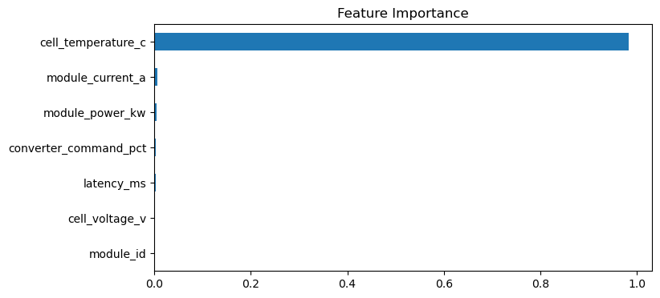
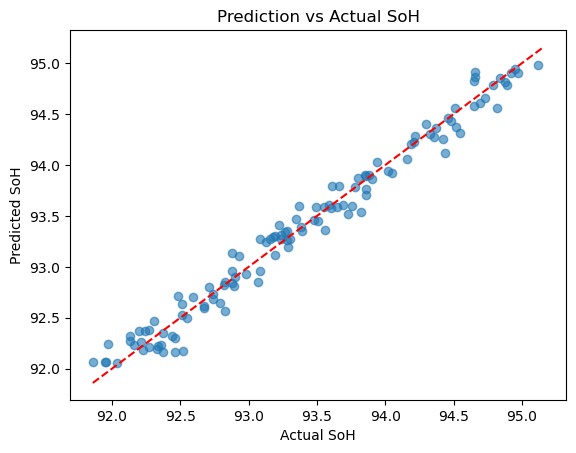

# Battery State Regression for Battery Management System (BMS) Data

## Project Overview

This project focuses on analyzing and predicting the **State of Health (SoH)** of battery modules based on sensor data collected from Battery Management Systems (BMS). Accurate SoH estimation is vital for maintaining battery performance, safety, and longevity in applications such as electric vehicles and energy storage.

The dataset includes measurements such as cell voltage, temperature, current, power, and control commands from multiple battery modules. Using these inputs, machine learning models are developed to provide reliable SoH predictions, helping predict battery aging and informing maintenance schedules.

## Dataset Description

The dataset consists of 600 records with these key columns:

- `timestamp`: Date and time of the measurement
- `module_id`: Battery module identifier
- `cell_voltage_v`: Voltage per cell (Volts)
- `cell_temperature_c`: Cell temperature (Degrees Celsius)
- `module_current_a`: Current through the module (Amperes)
- `module_power_kw`: Power consumption or delivery (Kilowatts)
- `converter_command_pct`: Converter control command (%)
- `soc_pct`: State of Charge (%)
- `soh_pct`: State of Health (%) — target variable
- `anomaly_score_pct`: Anomaly score (%)
- `diagnostic_flag`: Diagnostic flag (all False in this dataset)
- `latency_ms`: Data latency in milliseconds

## Project Structure and Workflow

- **Exploratory Data Analysis (EDA):** Investigates distributions, correlations, and relationships of BMS parameters, providing domain insights into voltage stability, temperature effects, current and power patterns.
- **Feature Engineering:** Preprocesses data by cleaning, encoding categorical variables, and scaling features for consistent model input.
- **Model Development:** Utilizes Random Forest Regression to predict SoH based on sensor inputs.
- **Model Evaluation:** Performance assessed through metrics including Mean Squared Error (MSE) and R² score with cross-validation to ensure robustness.
- **Interpretation:** Analyzes feature importance to understand key variables influencing battery health.

## Results Summary

- The Random Forest Regression model achieves reliable SoH predictions with strong R² scores.
- Battery voltage, temperature, and current are the most influential features for SoH estimation.
- The exploratory data analysis reveals important battery behaviors and relationships key for BMS insights.

### Feature Importance

### Predicted vs Actual State of Health

